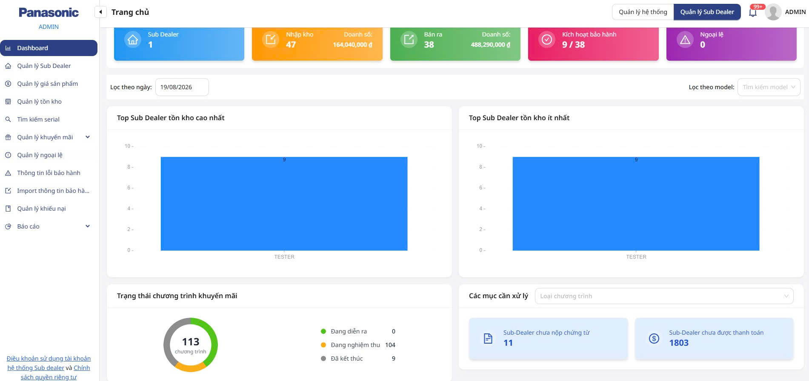
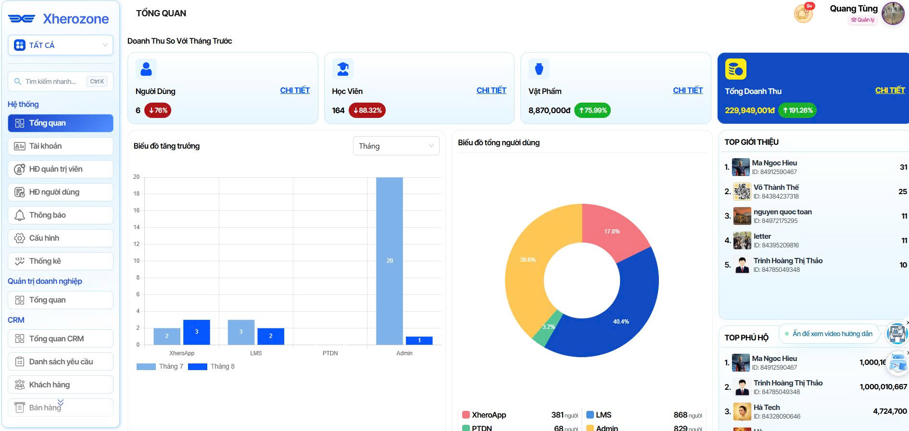
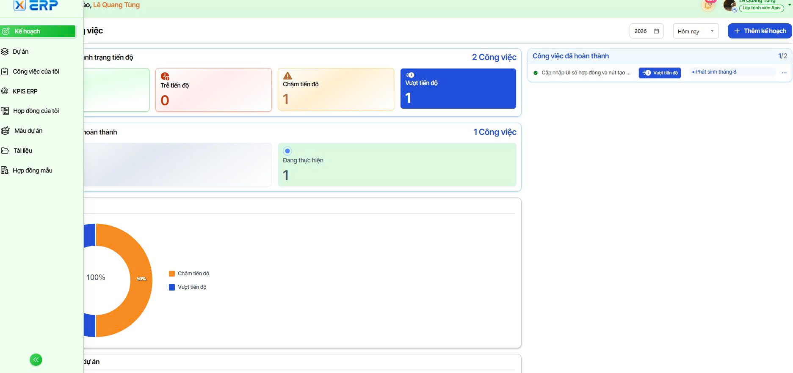

# LÊ QUANG TÙNG

## FULLSTACK DEVELOPER

📧 [tunglq.work@gmail.com](mailto:tunglq.work@gmail.com) · 📞 (+84) 789 881 495

---

## TÓM TẮT CHUYÊN MÔN

**Vấn đề giải quyết:** Các doanh nghiệp thường gặp khó khăn với hệ thống phân tán, rời rạc giữa quản lý vận hành, bán hàng và đối soát tài chính, dẫn đến giảm hiệu suất và sai lệch dữ liệu.

**Giải pháp & Năng lực:** Thiết kế kiến trúc nền tảng hợp nhất, hiệu năng cao bằng **React** và **NestJS Microservices**. Tích hợp sâu rộng logic nghiệp vụ phức tạp với các hệ sinh thái bên ngoài, xây dựng quy trình CI/CD tự động hóa đảm bảo luồng dữ liệu thông suốt.

**Giá trị mang lại:** Bàn giao các hệ thống chuẩn Enterprise tối ưu thời gian xử lý, tuân thủ nghiêm ngặt pháp lý/tài chính. Thành thạo quản lý trọn vòng đời SDLC và tối ưu hạ tầng Cloud cho uptime tối đa.

---

## KỸ NĂNG CHUYÊN MÔN

| Nhóm | Công nghệ |
|------|-----------|
| **Ngôn ngữ** | JavaScript, TypeScript, C#, C++, Python |
| **Frontend** | ReactJS (v19), Vite, Next.js, React Native, Expo, Tailwind CSS, Shadcn/ui, Ant Design, Zustand, React Query, TanStack Table |
| **Backend** | Node.js, NestJS, .NET, Socket.io, RabbitMQ, Swagger, Passport.js, TypeORM, Mongoose |
| **Cơ sở dữ liệu** | PostgreSQL, MySQL, MSSQL, MongoDB, Firebase |
| **Cloud & DevOps** | Azure DevOps (CI/CD Pipelines), Azure App Service, Azure Blob Storage, Docker, Nginx, Quản trị VPS (GCP/Self-hosted), DNS, SSL (Certbot), MinIO |
| **Quy trình & Khác** | Agile/Scrum, SDLC, Git, Postman, Docker Desktop |

---

## KINH NGHIỆM LÀM VIỆC

### Tập Đoàn Phong Thủy Đại Nam — Fullstack Developer
`11/2025 – 07/2026`

- **Tái cấu trúc hệ thống cốt lõi:** Tái kiến trúc sản phẩm nhằm tích hợp module xếp lịch tự động liên phòng ban và module tính điểm hiệu suất công việc.
- **Phát triển Agile:** Ứng dụng MERN stack và Socket.io xây dựng các module hoàn chỉnh, đảm bảo khả năng mở rộng.
- **Kết quả:** Loại bỏ hoàn toàn việc xếp lịch thủ công, nâng cao tính ổn định của hệ thống và thiết lập quy trình đo lường năng suất minh bạch.

### AI Dynamix — Fullstack Developer
`04/2024 – 10/2025`

- **Phát triển sản phẩm nhanh:** Xây dựng các nền tảng E-commerce và Media thời gian thực theo mô hình Agile với MERN stack và Socket.io.
- **Tự động hóa CI/CD:** Thiết lập Pipelines trên Azure DevOps/GitLab, giảm đáng kể lỗi triển khai thủ công và đẩy nhanh chu kỳ phát hành sản phẩm.

### Freelancer — Fullstack Developer
`01/2023 – 03/2024`

- **Giải pháp Web quy mô lớn:** Thiết kế kiến trúc Admin Dashboard và Backend bằng ReactJS & NestJS để xử lý các luồng nghiệp vụ phức tạp (đối soát tài chính, quản lý Multi-tenant).
- **Tích hợp pháp lý & Hạ tầng:** Triển khai tích hợp hóa đơn/hợp đồng điện tử. Cấu hình VPS (GCP), DNS và Nginx Reverse Proxy tăng cường bảo mật và cân bằng tải.

---

## DỰ ÁN TIÊU BIỂU

### Panasonic PSV: Electronics Retail & Promotion Engine
`01/2025 – 10/2025` · **Vai trò:** Team / Module Lead

[](https://subdealer.vn.panasonic.com/login)

- **Quản lý kho & Chuỗi cung ứng:** Xây dựng hệ thống định danh chính xác cao với Tracer technology theo dõi biến động tồn kho realtime trên mạng lưới kho phân tán.
- **Promotion Engine đa năng:** Thiết kế hệ thống báo cáo & trả thưởng linh hoạt cho các chiến dịch tiếp thị, tự động hóa duyệt thưởng và phân tích hiệu suất theo thời gian thực.
- **Bảo hành điện tử (E-warranty):** Số hóa toàn diện vòng đời từ kích hoạt thiết bị đến quyết toán hoa hồng đại lý.
- **Hạ tầng & Cloud:** Quản trị trên Azure Cloud Services, thiết lập CI/CD Pipelines (Azure DevOps), Docker, Nginx và SSL/DNS.

> **Tech Stack:** ReactJS, Vite, Shadcn/ui, NestJS, Azure DevOps, Azure Blob Storage, Docker, GitHub, QR-Scanner

🔗 [Xem dự án](https://subdealer.vn.panasonic.com/login)

---

### GotrackID: Hospital Asset Management System (HAMS)
`01/2025 – 04/2025` · **Vai trò:** Fullstack Developer

- **Theo dõi tài sản qua RFID:** Xây dựng giao diện đồng bộ hệ thống đọc RFID, thuật toán định vị/truy vết thiết bị y tế realtime ("Find My Device") theo vùng phòng bệnh.
- **IoT Edge Integration & State Machine:** Tầng xử lý tín hiệu tần số cao từ anten RFID; thiết kế State Machine kiểm soát trọn vòng đời thiết bị qua các cổng quét tự động.
- **Kho vận y tế:** Tối ưu luồng nhập/xuất/điều chuyển hàng loạt bằng RFID quét theo lô, giảm 95% thời gian thao tác thủ công.

> **Tech Stack:** ReactJS, NestJS, IoT/RFID Integration, PostgreSQL, Docker

---

### XHEROZONE CRM: Web Admin & CRM
`11/2025 – 07/2026` · **Vai trò:** Fullstack Developer

| Web Admin & CRM | X ERP — Project Management |
|:---:|:---:|
| [](https://admin.xheroapp.com/sign-in) | [](https://erp.xherozone.com/) |
| [admin.xheroapp.com](https://admin.xheroapp.com/sign-in) | [erp.xherozone.com](https://erp.xherozone.com/) |

- **Xếp lịch làm việc thông minh:** Thuật toán tự động phân bổ công việc theo ràng buộc thời gian, lịch làm việc hành chính và ngày lễ, triệt tiêu xung đột lịch.
- **Đánh giá năng suất động:** Engine tính điểm nhân viên dựa trên khối lượng công việc và thời gian hoàn thành, cập nhật điểm số realtime.
- **Báo cáo & Phê duyệt tự động:** Tổng hợp dữ liệu năng suất tập trung, xuất nhật ký hiệu suất có cấu trúc cho luồng phê duyệt đa cấp.

> **Tech Stack:** MERN Stack, Socket.io, Tailwind CSS, RESTful API

---

## HỌC VẤN

| Trường / Trung tâm | Thời gian |
|--------------------|-----------|
| Trường Đại học Sư phạm Kỹ thuật TP.HCM (HCMUTE) | 2019 – 2023 |
| Trung tâm Đào tạo FUNiX | 02/2024 – 08/2024 |

---

## LIÊN KẾT

- 🌐 [Portfolio CV Web](index.html)
- 💼 [LinkedIn](https://www.linkedin.com/in/letung420310/)
- 👤 [Facebook](https://www.facebook.com/quang.tung.5283)
- 💻 [GitHub](https://github.com/LQTungFX32577)

---

## CHẠY DỰ ÁN LOCAL

```bash
cd CVWeb
python -m http.server 8765
http://localhost:8765/
```

Mở trình duyệt tại `https://lqtungfx32577.github.io/CVWeb/` — hỗ trợ chuyển đổi ngôn ngữ **VI / EN** trên giao diện.
